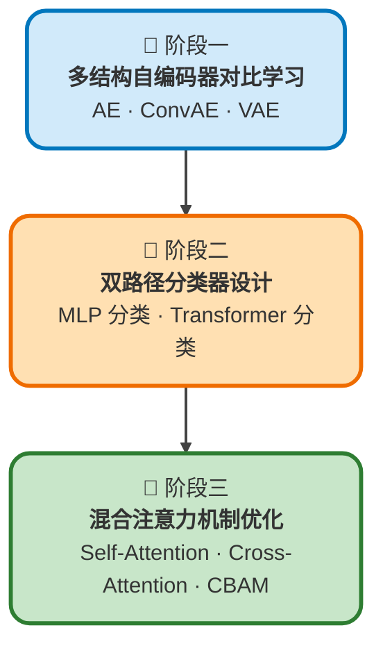

# 基于自编码器的图像分类算法设计与实现
- 仓库主题：**基于自编码器的图像分类**算法设计与实现

```mermaid
flowchart TD
    A["🔹 阶段一<br/><strong>多结构自编码器对比学习</strong><br/>AE · ConvAE · VAE"]
    B["🔸 阶段二<br/><strong>双路径分类器设计</strong><br/>MLP 分类 · Transformer 分类"]
    C["🔷 阶段三<br/><strong>混合注意力机制优化</strong><br/>Self-Attention · Cross-Attention · CBAM"]

    A --> B
    B --> C

    classDef s1 fill:#d1eafa,stroke:#0277bd,stroke-width:3px,rx:14,ry:14
    classDef s2 fill:#ffe0b2,stroke:#ef6c00,stroke-width:3px,rx:14,ry:14
    classDef s3 fill:#c8e6c9,stroke:#2e7d32,stroke-width:3px,rx:14,ry:14

    class A s1
    class B s2
    class C s3

    linkStyle 0 stroke:#424242,stroke-width:2px
    linkStyle 1 stroke:#424242,stroke-width:2px
```