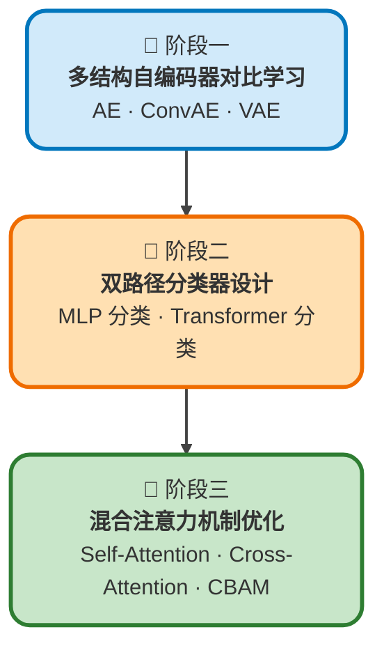

# 基于自编码器的图像分类算法设计与实现
**本项目完整实现“自编码器特征学习 + 双分类器对比 + 混合注意力增强”的全流程图像分类框架**，以 **AE、ConvAE、VAE** 三种无监督模型作为特征提取器，分别对接 **MLP 与 Transformer** 分类头，并引入 **自注意力、交叉注意力、CBAM** 进行模型增强，在 [CUB-200-2011](https://www.vision.caltech.edu/datasets/cub_200_2011/), [FashionMNIST](https://github.com/zalandoresearch/fashion-mnist), [MNIST](http://yann.lecun.com/exdb/mnist/) 等公开数据集上完成系统对比与消融实验，形成一套高效的图像分类算法。


## 📌 项目核心定位
- 面向**计算机视觉 / 深度学习 / 模式识别**方向的完整算法项目
- 以**无监督特征学习 + 有监督分类**为核心技术路线
- 提供**三种自编码器、两种分类器、三种注意力机制**的统一对比框架



## 🔷 阶段一：多结构自编码器对比学习 | AE · ConvAE · VAE
本阶段在 [FashionMNIST](https://github.com/zalandoresearch/fashion-mnist), [MNIST](http://yann.lecun.com/exdb/mnist/) 数据集上，分别实现并训练 **全连接自编码器（AE）、卷积自编码器（ConvAE）、变分自编码器（VAE）** 三种无监督特征学习模型。通过无监督重构任务，让模型自动学习图像的低维紧凑特征表示，并从 **重构精度、潜在空间可分性、特征鲁棒性** 三个维度进行定量与定性对比。

- **AE（全连接自编码器）**：采用全连接网络结构，将 784 维图像展平后压缩至 64 维潜在空间。模型结构简单、训练快速，但由于未利用图像空间结构信息，特征表达能力有限，重构效果相对较弱，潜在空间可分性一般。
- **ConvAE（卷积自编码器）**：引入卷积、池化与反卷积结构，充分利用图像局部空间相关性，通过权重共享减少参数量，特征提取更高效。在相同潜在维度下，重构质量显著优于 vanilla AE，学习到的特征更具判别性，更适合作为图像特征提取器。
- **VAE（变分自编码器）**：基于概率生成模型构建，将潜在向量表示为高斯分布，通过重参数化技巧完成端到端训练。VAE 约束潜在空间满足连续平滑的先验分布，使特征具备更好的泛化能力与可生成性，在后续分类任务中表现更稳定。

通过重构损失曲线、图像重建可视化、潜在空间二维聚类效果对比，验证 **ConvAE 与 VAE 在特征表示能力上明显优于传统全连接 AE**，其中 VAE 因潜在空间的概率特性最适合作为下游分类任务的特征提取主干。


## 🔶 阶段二：双路径分类器设计 | MLP 分类 · Transformer 分类
本阶段**复用阶段一训练完毕的三种编码器作为固定特征提取器**，冻结编码器权重以保留无监督学习到的通用特征，仅在编码器输出的潜在表示后搭建分类头，构建 **“自编码器 + 分类器”** 的完整图像分类流程，并系统对比两种分类结构的效果。

- **MLP 分类器**：采用两层全连接网络 + Dropout(0.3) 结构，作为轻量基准模型。模型推理快、收敛快，但仅对潜在向量做简单非线性映射，无法捕捉特征内部依赖关系，在复杂模式上受限明显。
- **Transformer 分类器**：将一维潜在向量扩展为序列格式，加入可学习位置编码，通过多层 Transformer 编码器与多头自注意力机制，捕捉潜在特征间的长距离依赖与全局关联。相比 MLP，模型具备更强的特征建模与细粒度区分能力。

实验结果表明：
1. 自编码器学到的特征质量直接决定分类上限，**VAE 特征 > ConvAE 特征 > AE 特征**；
2. Transformer 分类器在准确率、收敛稳定性、抗过拟合能力上**全面优于 MLP 分类器**；
3. 本阶段完整实现了**无监督特征学习 → 有监督分类**的迁移流程，证明自编码器可有效学习可判别性视觉特征。


## 🔷 阶段三：混合注意力机制优化 | Self-Attention · Cross-Attention · CBAM
为进一步提升模型在细粒度分类与复杂场景下的性能，本阶段以 **CVAE（卷积变分自编码器）+ Transformer** 为基础框架，**融合多重注意力机制**形成增强型模型，通过消融实验验证各模块的作用与互补性。

- **自注意力（Self-Attention）**：在特征序列内部建立全局依赖，建模远距离关联，提升整体语义理解能力，单独使用可带来明显精度提升。
- **交叉注意力（Cross-Attention）**：实现编码器特征与分类器特征的交互对齐，强化关键信息传递，增强特征的针对性与判别性。
- **CBAM（卷积块注意力模块）**：同时建模通道注意力与空间注意力，让模型自动关注关键区域、抑制背景噪声，对细粒度差异（如纹理、局部结构）尤为敏感。

实验结果表明：
1. 三种注意力机制单独使用均可稳定提升模型性能；
2. 三者联合使用时形成**互补效应**，自注意力捕捉全局、交叉注意力增强交互、CBAM 聚焦局部关键区域；
3. 混合注意力增强模型相较基准模型分类准确率显著提升，在细粒度图像分类任务中优势更明显。

最终形成一套 **CVAE + Transformer + 混合注意力** 的完整图像分类算法，兼具特征学习、全局建模、局部聚焦能力，具备理论研究与实际应用价值。


## 📁 项目文件结构
```powershell
project/
├── three_kinds_auto_encoder/                   # 阶段一：3 种自编码器对比学习（AE · ConvAE · VAE）
├── mlp_classifier+3auto_encoder+mnist/         # 阶段二：MLP 分类器，在 MNIST 数据集上训练 + 测试
├── transformer_classifier+3auto_encoder+mnist/ # 阶段二：Transformer 分类器，在 MNIST 数据集上训练 + 测试
├── cvae_transformer/                           # 阶段二最优搭配：CVAE 编码器 + Transformer 分类器，在 FashionMNIST 数据集上训练 + 测试
├── cvae_transformer-attn/                      # 阶段三：在原本 cvae_transformer 的基础上加上注意力机制
├── CUB/                                        # 阶段三：使用 cvae_transformer-attn 在 CUB 数据集上测试
└── README.md                                   # 项目说明文档
```

```powershell
# 上面的文件树是对整个项目的介绍
# 本文件树聚焦于实验结果（测试结果）的保存
project/
├── mlp_classifier+3auto_encoder+mnist/mlp_classifier_mnist_pytorch.log                 # 阶段二的一个结果
├── transformer_classifier+3auto_encoder+mnist/transformer_classifier_mnist_pytorch.log # 阶段二的一个结果
├── cvae_transformer/result/            # 阶段二 cvae_transformer 在 FashionMNIST 数据集上训练的结果
└── cvae_transformer-attn/result/       # 阶段三 cvae_transformer 在 FashionMNIST 数据集上训练的结果
```


## 🧩 技术栈
- **框架**：PyTorch
- **核心模型**：自编码器（AE/ConvAE/VAE）
- **分类头**：MLP、Transformer
- **注意力机制**：自注意力、交叉注意力、CBAM
- **数据集**：MNIST
- **任务**：图像分类、无监督特征学习、细粒度分类


## 🎯 项目亮点
1. **三编码器统一对比**：AE / ConvAE / VAE 结构标准化实现
2. **双分类器公平比较**：MLP 与 Transformer 直接对照
3. **注意力机制可插拔**：支持消融实验与组合验证
4. **代码完全复用**：编码器不重复实现，分类器即插即用

